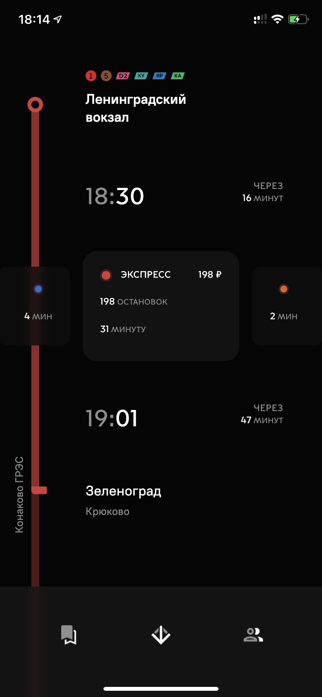
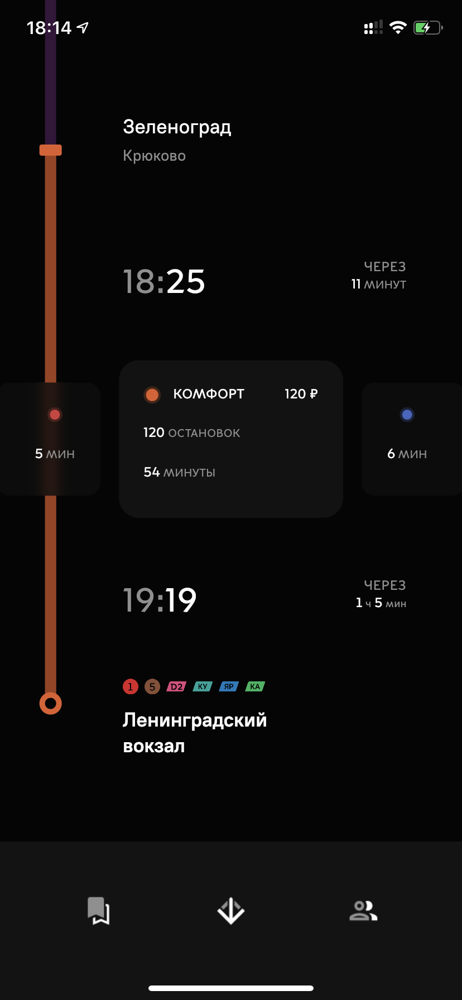
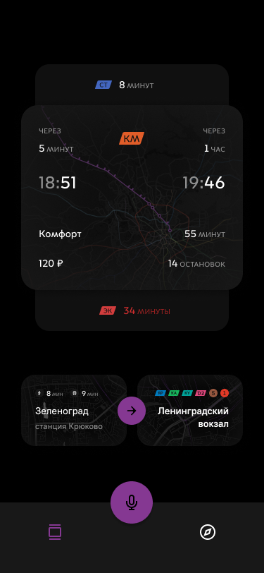
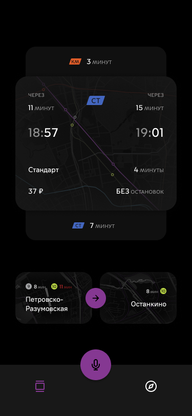
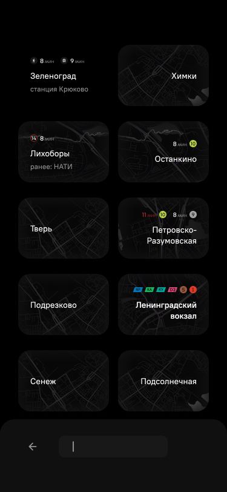
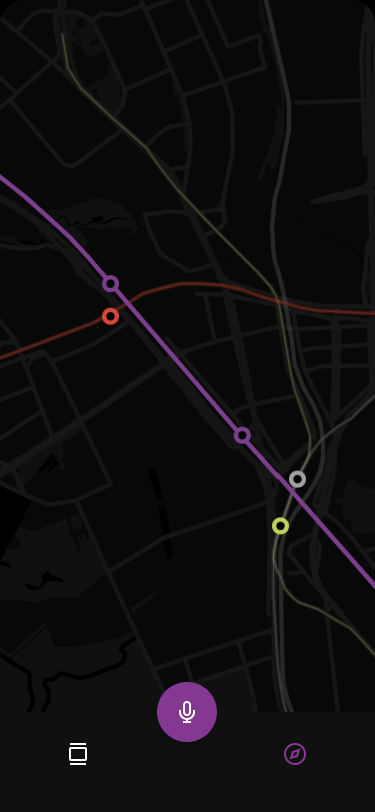
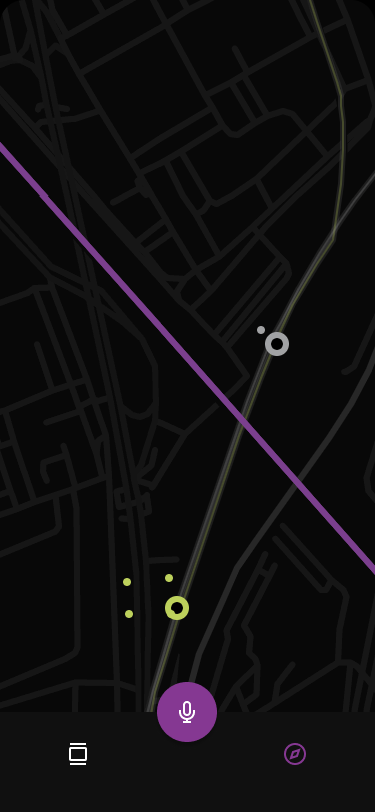

# Приложение Flutter для просмотра расписания московских электричек Тверского направления

# Реализовано

### Расписание

 

### Выбор станции

 

## Планируется

### Расписание

 

### Выбор станции

 

### Карта

 
