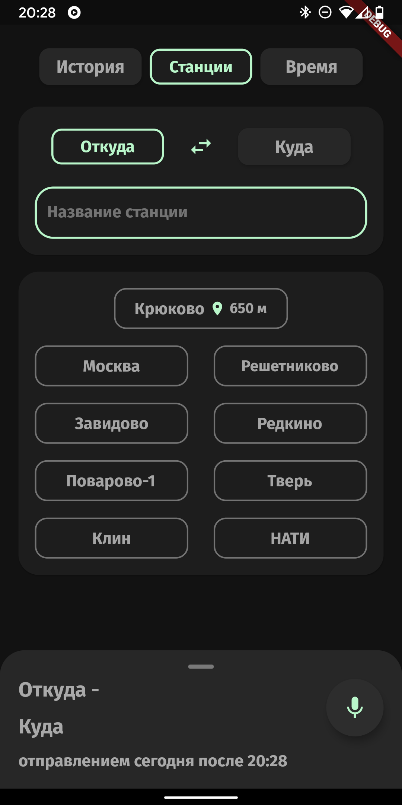
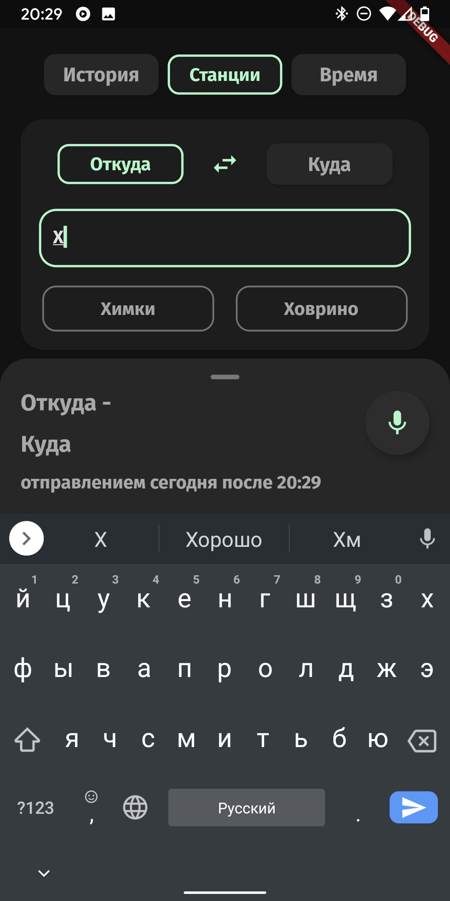
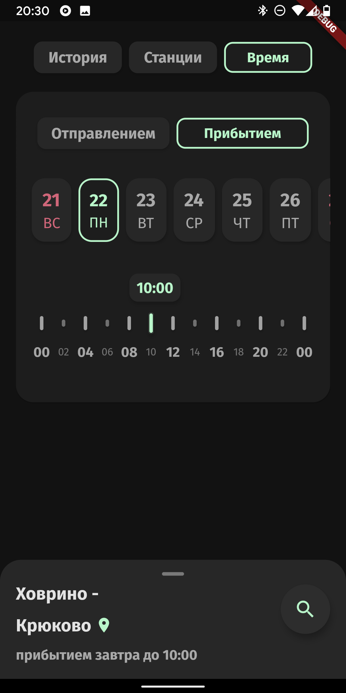
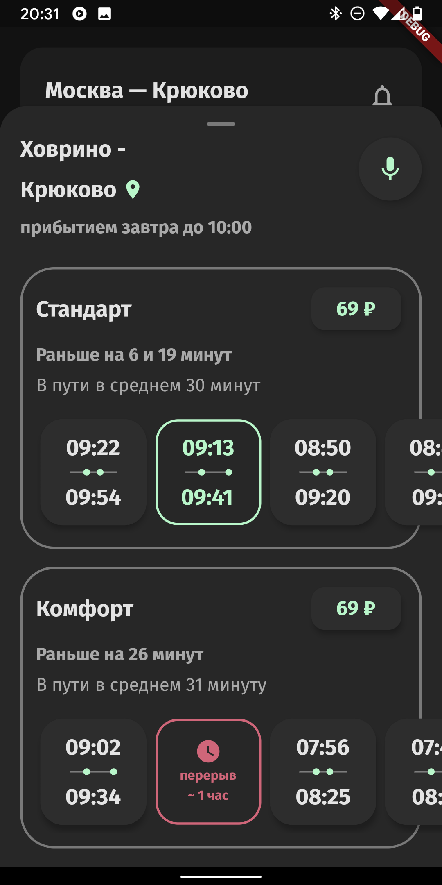
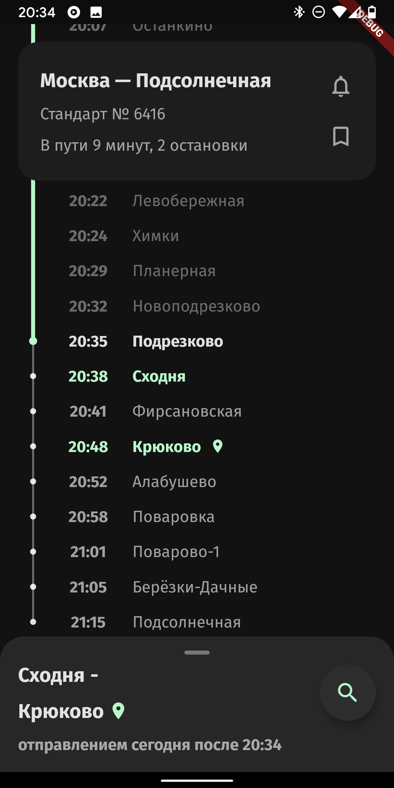

# App to show schedule of Moscow suburban trains

Built using Flutter (BloC pattern) and Firebase Firestore.

Right now supports only 38 stations of Moscow - Tver direction.

Key features:
- Searching by departure or arrival date and time
- Fast and error-free stations input
- Train's schedule display in real time
- Schedule long breaks warnings
- Visual separation of train categories with prices and general info on the closest trains from each
- Dark theme using Material Design guidelines

 
 

